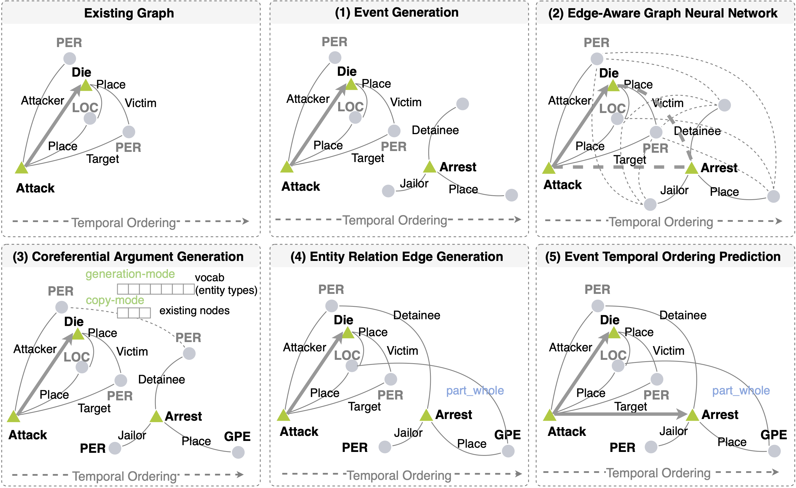

# Temporal Event Graph Schema Induction

Table of Contents
=================
  * [Overview](#overview)
  * [Data](#data)
  * [Reference](#reference)

## Overview
Data and code for the paper ["Future is not One-dimensional: Complex Event Schema Induction via Graph Modeling"](https://arxiv.org/abs/2104.06344). The code will be released soon.

<p align="center">
  
</p>


## Data
1. The Schema Learning Corpus is released by LDC (LDC2020E25), with human schema included. Please find the event graphs in `data/LDC_schema_corpus_ce_split`, which are extracted using [RESIN Information Extraction System](https://blender.cs.illinois.edu/paper/resin-phase1.pdf).

2. Please find the Wikipedia IED corpus in `Wiki_IED_split.tgz` (event graphs) and `Wiki_IED_rawdata` (raw text). The human schemas are in `data/RESIN_schema`.

## Reference
```
@article{li2021future,
  author    = {Manling Li and Sha Li and Zhenhailong Wang and Lifu Huang and Kyunghyun Cho and Heng Ji and Jiawei Han and Clare R. Voss},
  title     = {Future is not One-dimensional: Graph Modeling based Complex Event Schema Induction for Event Prediction},
  journal   = {arXiv preprint arXiv:2104.06344},
  year      = {2021},
  url       = {https://arxiv.org/abs/2104.06344},
}
```
